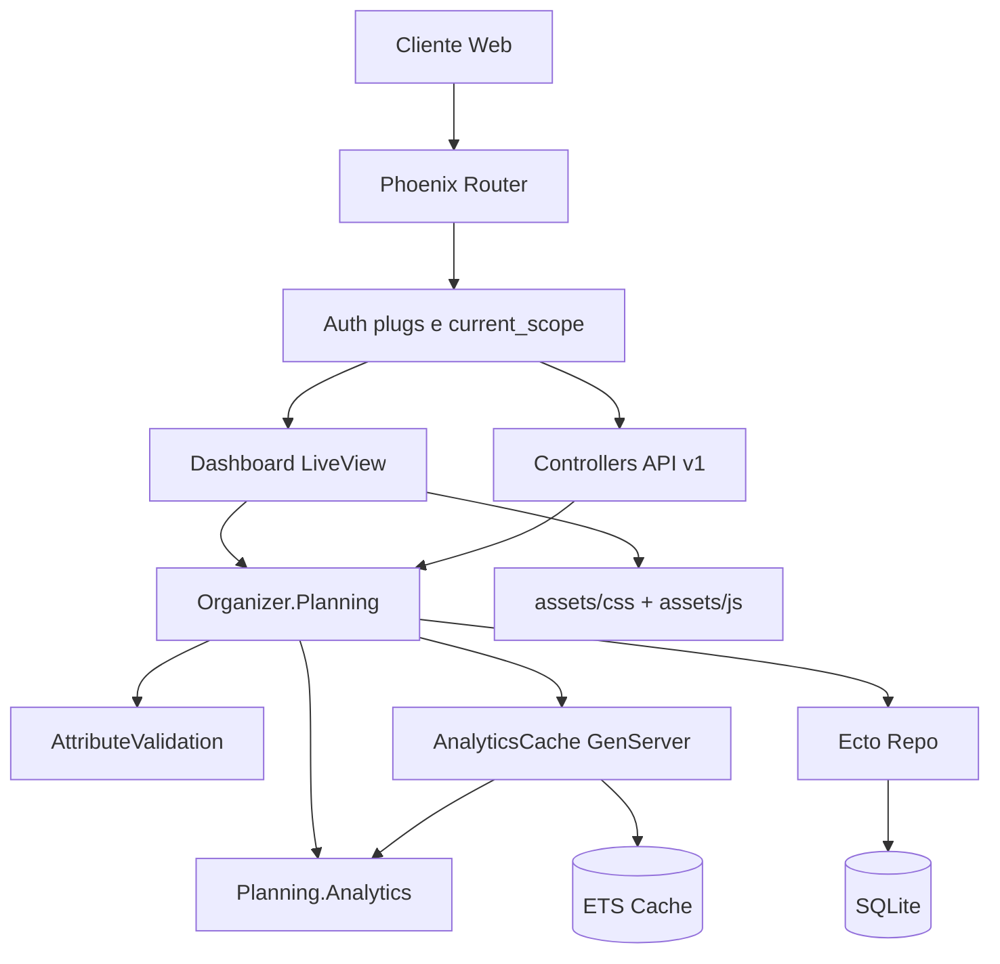

# Organizer

Aplicação de organização pessoal com Phoenix (LiveView + API), SQLite e autenticação multiusuário.

## Estado atual da aplicação

- Autenticação web completa com `phx.gen.auth` (registro, login, sessão, recuperação de senha e configurações de conta).
- Dashboard LiveView em `/dashboard` com fluxo de operação diária e visão analítica.
- Importação em lote por texto no dashboard com:
	- templates rápidos (`mixed`, `tasks`, `finance`, `goals`)
	- pré-visualização, correções guiadas e importação incremental por bloco
	- histórico de payload, favoritos, modo estrito e desfazer última importação
- Operações de tarefas, finanças e metas no mesmo painel com filtros e edição inline.
- Classificação financeira por lançamento de despesa com natureza (`fixed`/`variable`) e forma de pagamento (`credit`/`debit`) no fluxo de captura rápida.
- Visão analítica com comparativos por período, capacidade planejada e indicadores de risco de sobrecarga.
- API REST em `/api/v1` para:
	- `tasks`
	- `finance-entries`
	- `goals`
	- `fixed-costs`
	- `important-dates`
- Isolamento por usuário em todas as consultas de domínio via `Scope`.

## Arquitetura



### Infraestrutura OTP

A aplicação utiliza padrões OTP para performance e escalabilidade:

- **AnalyticsCache (GenServer)**: Cache distribuído com ETS para cálculos de analytics. Fornece invalidação automática quando tarefas, finanças ou metas são alteradas. TTL de 5 minutos com fallback automático em cache miss.
  - Chave de cache: `analytics:user:{user_id}:days:{days}`
  - Acesso: `Organizer.Planning.AnalyticsCache.get_analytics/2`
  - Isolamento por usuário para segurança

- **Task.Supervisor**: Gerenciador de tarefas assíncronas para operações não-bloqueantes (email, bulk operations). Nomeado como `Organizer.TaskSupervisor`.
  - Uso: `Task.Supervisor.async_nolink(Organizer.TaskSupervisor, fn -> ... end)`

- **Phoenix.PubSub**: Sistema de pub/sub para broadcast de eventos (atualmente usado por LiveDashboard e telemetria).

## Convenções de código e evolução

- Guia de inserção de novo código: [CODEBASE_GUIDELINES.md](CODEBASE_GUIDELINES.md)
- Diretrizes visuais e de componentes: [DESIGN_SYSTEM.md](DESIGN_SYSTEM.md)
- Planejamento de evolução do produto: [ROADMAP.md](ROADMAP.md)

## Rodando local (sem Docker)

- `mix setup`
- `mix phx.server` ou `iex -S mix phx.server`

Aplicação disponível em `http://localhost:4000`.

## Rodando com Docker

```bash
docker compose up --build
```

Aplicação em `http://localhost:4000`.

### Executando testes com Make

```bash
make test-domain
make test-web
make test-all
make run
```

Aliases de compatibilidade:

```bash
make test-unit
make test-stage2
```

Versão sem Docker (Mix local):

```bash
make test-domain-local
make test-web-local
make test-local-all
```

Banco local (dev):

```bash
make db-create
make db-migrate
make db-reset
```

### Suite unit-first (Docker)

```bash
sh scripts/tests/domain_suite.sh
```

Foco em regras de domínio (sem testes de integração web). O script imprime o tail e finaliza com `DOMAIN_EXIT:<code>`.

Atalho legado mantido: `sh scripts/test_unit.sh`.

### Suite focada da etapa web (Docker)

```bash
sh scripts/tests/web_suite.sh
```

O script imprime o tail dos testes e finaliza com `WEB_EXIT:<code>`.

Atalho legado mantido: `sh scripts/test_stage2.sh`.

## Deploy Fly.io (base)

Passo inicial de deploy manual:

1. Criar app e volume.
2. Configurar `SECRET_KEY_BASE`.
3. Executar `fly deploy`.

O runbook completo de operação e automação de pipeline ainda está em evolução (ver [ROADMAP.md](ROADMAP.md)).

## Referências Phoenix

- https://www.phoenixframework.org/
- https://hexdocs.pm/phoenix/overview.html
- https://hexdocs.pm/phoenix
