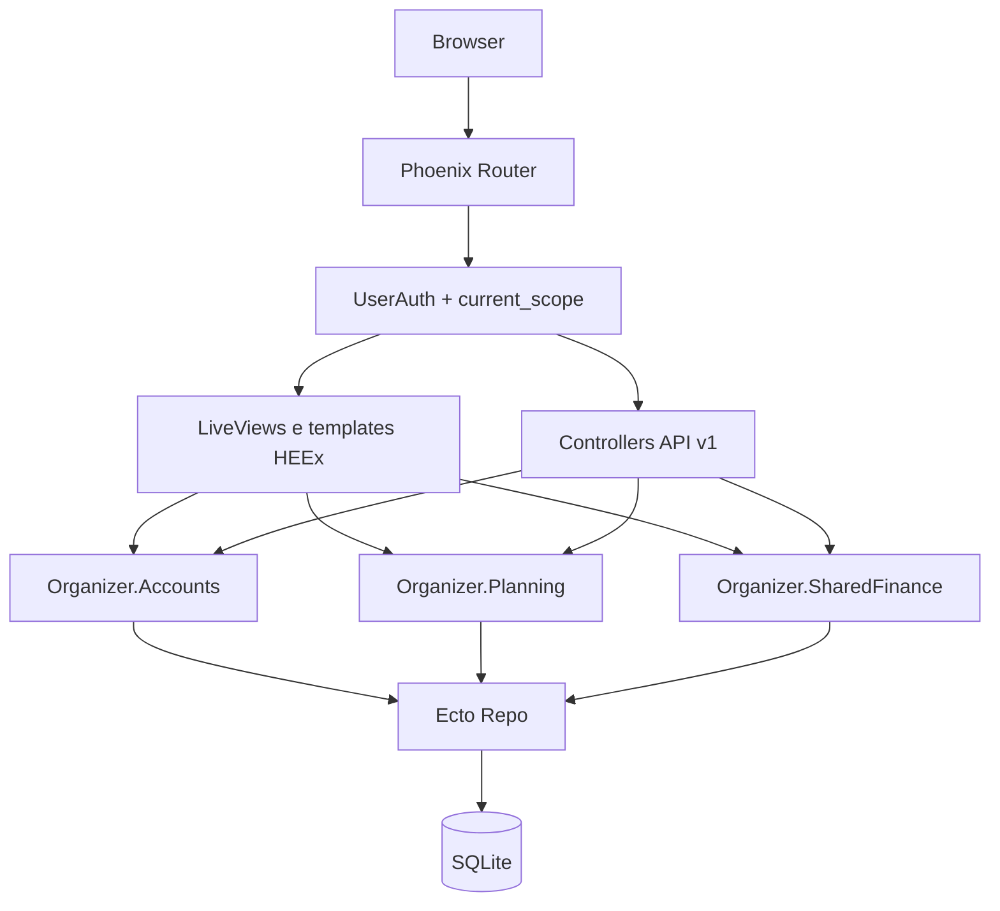

# Arquitetura

## Visão macro

Organizer usa Phoenix com dois canais de entrada:

- Web com LiveView (`/finances`, `/account-links`, `/users/settings`)
- API REST autenticada (`/api/v1`)

Ambos convergem para contexts de domínio com isolamento por `current_scope`.

## Fluxo de camadas

## Módulos chave

### Web

- `lib/organizer_web/router.ex`: escopos, pipelines e auth boundary
- `lib/organizer_web/live/*.ex`: orquestração de telas autenticadas
- `lib/organizer_web/controllers/*_html/*.heex`: telas de controller (área pública/auth)
- `lib/organizer_web/components/layouts*`: shell global e layout base
- `assets/js/app.js` + `assets/js/hooks/*`: interop LiveView orientado a funções
- `assets/css/app.css`: tokens globais, tema Neon Grid, motion utilities

### Domínio

- `lib/organizer/accounts.ex`
- `lib/organizer/planning.ex`
- `lib/organizer/shared_finance.ex`

## Diretrizes obrigatórias

1. Regra de negócio fica em context.
2. LiveView/controller só orquestra estado de interface e delega ao domínio.
3. JS cobre apenas capacidades de browser e ergonomia local.
4. Toda leitura/mutação sensível respeita `current_scope`.
5. UI segue padrão Tailwind-first + tema `organizer_neon_grid`.

## Roteamento e autenticação

- `:browser` inclui `fetch_current_scope_for_user`
- `live_session :authenticated` protege área LiveView
- `:api` + `:require_authenticated_api_user` protege API

Referências oficiais:

- Phoenix routing: https://hexdocs.pm/phoenix/routing.html
- LiveView lifecycle: https://hexdocs.pm/phoenix_live_view/welcome.html
