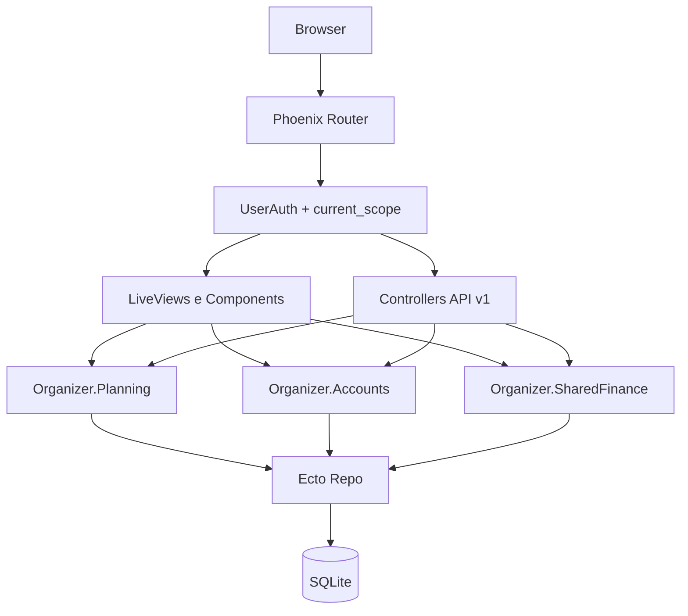

# Arquitetura

## Visão macro

O Organizer é uma aplicação Phoenix com dois canais principais de entrada:

- Interface web com LiveView (`/finances` e fluxos de vínculo entre contas)
- API REST (`/api/v1`) para operações de domínio

Ambos convergem para contexts de domínio que aplicam regras de negócio com isolamento por usuário (`current_scope`).

## Fluxo de camadas

## Módulos principais

### Web

- `lib/organizer_web/router.ex`: roteamento e boundaries de autenticação
- `lib/organizer_web/live/*.ex`: LiveViews de finanças e colaboração
- `lib/organizer_web/components/*.ex`: function components reutilizáveis
- `assets/js/app.js`: hooks e interop JS do LiveView
- `lib/organizer_web/storybook.ex` + `storybook/**`: catálogo de componentes no ambiente de desenvolvimento

### Domínio

- `lib/organizer/planning.ex`: finanças, custos fixos e datas importantes
- `lib/organizer/shared_finance.ex`: vínculo de contas e colaboração financeira
- `lib/organizer/accounts.ex`: autenticação, usuários e preferências

## Roteamento e autenticação

A estratégia segue o padrão oficial de pipelines Phoenix + `live_session` para LiveView autenticado:

- Pipeline `:browser` com `fetch_current_scope_for_user`
- `live_session :authenticated` para páginas LiveView protegidas (`/finances`, `/account-links...`)
- Pipeline `:api` + `:require_authenticated_api_user` para API REST

No fluxo de colaboração, o acerto mensal roda na própria rota `/account-links/:link_id` (não existe mais tela separada de settlement).

Referências oficiais:

- Phoenix routing: https://hexdocs.pm/phoenix/routing.html
- LiveView welcome/lifecycle: https://hexdocs.pm/phoenix_live_view/welcome.html

## Diretriz arquitetural obrigatória

1. Regra de negócio pertence aos contexts, não a controllers/components.
2. LiveView orquestra estado de tela e delega ao contexto.
3. JS existe para capacidades de browser, não para substituir estado de domínio.
4. Toda consulta mutável/leitura sensível deve respeitar `current_scope`.
